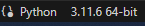

# python environment testing
## documented steps
1. Visited https://www.python.org/downloads/windows/ downloaded python (3.11.#)
2. `add to PATH` was selected in the installation to add system variable
3. Created a `.py` file within vscode and confirmed interpreter was detected

4. Created a local virtual environment